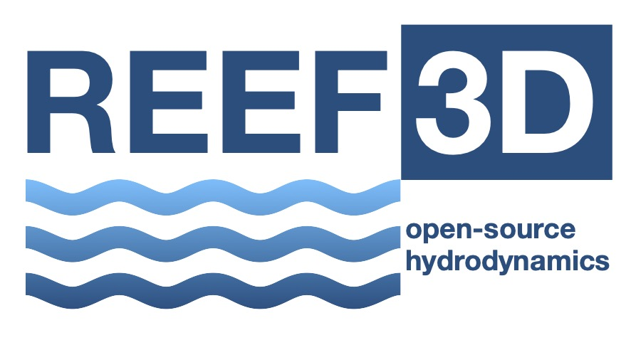

<!-- # REEF3D -->

<!--  -->

[Overview](#Overview) -
[Features](#Features) -
[Documentation](#Documentation) -
[Get Help](#get-help) -
[Contribute](#Contribute) -
[Copyright Notice](#copyright-notice) -
[License](#License)

## Overview

REEF3D is an hydrodynamics framework that offers open-source CFD and wave models.
The software is efficiently parallelized, designed to run on a large number of processors.
High-order spatial and temporal discretization schemes result in accurate and stable numerical behavior.
The modular programming approach allows the framework to incorporate a range of different flow solvers which together represent all relevant length scales.
With a focus on marine, coastal and hydraulic engineering flows, tailor-made multiphysics solvers are available for a range of relevant problems (e.g. sediment transport or floating body dynamics).

More information is available on the [REEF3D website](https://reef3d.com).

## Features

- Multiple models for different application scales CFD, NHFLOW, FNPF, SFLOW
- Wave modeling and wave hydrodynamics
- Complex free surface flow
- Sediment transport
- Fluid-structure interaction
- Parallelization via MPI

## Documentation

See [UserGuide](REEF3d-UserGuide.pdf) for information about REEF3D functions and example cases.

<!-- ## Gallery -->

## Get Help

Visit the [forum](https://www.cfd-online.com/Forums/reef3d/).

## Contribute

REEF3D does currently not accept outside contributions.

<!-- ## Copyright Notice -->

<!--  -->

## License

License for REEF3D can be found in [LICENSE](LICENSE).

SPDX-License-Identifier: GPL-3.0-or-later

<!-- ## Citation -->
