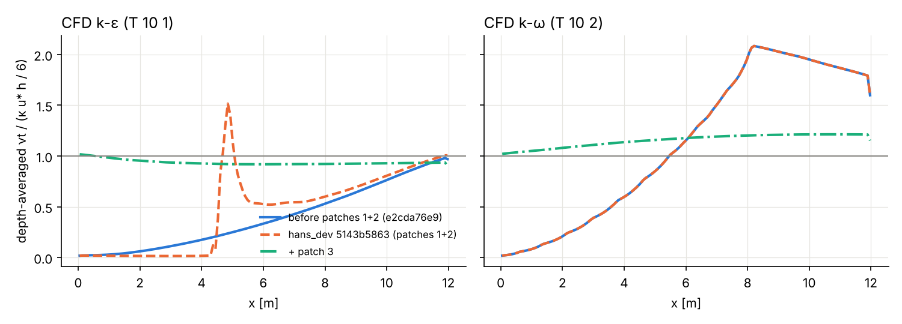
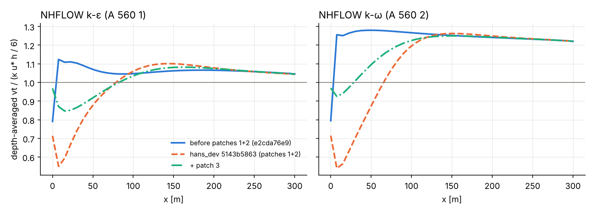
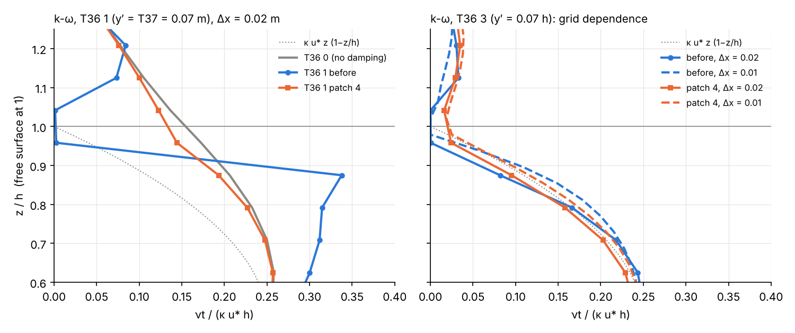

# Turbulence test cases (SFLOW, NHFLOW, CFD)

These cases test the turbulence fixes from 2026-10-03/04 (Turbulence Review, patches 1–4; all in hans_dev since 2118d1d97) against analytical equilibrium values, check MPI against serial runs, and test the free-surface damping (patch 4).

- **Repo:** REEF3D, branch `hans_dev`, with DIVEMesh `hans_dev` 95ae3a4.
- **Builds compared:**
  - **before**: e2cda76e9, before patches 1+2.
  - **hans_dev**: 5143b5863, with patches 1+2 committed.
  - **+ patch 3**: 5143b5863 + `261003_REEF3D_turbulence_3_inflow-on-5143b5863.patch` (= hans_dev 63a2108f7).
  - **+ patch 4**: 63a2108f7 + `261004_REEF3D_turbulence_4_freesurface-on-63a2108f7.patch`.
- **How they were run:** built in a Linux sandbox with g++ 13, `-O2`, without HYPRE.
  - Single rank: a serial MPI stub replaced MPI.
  - 2 ranks: minimpi, a small multi-process MPI subset over Unix-domain sockets (sandbox tool, not part of the repo).

## Running

From this folder, with the shared scripts in `../tools`:

```bash
../tools/run_case.sh  <REEF3D> <DiveMESH> cases/<case> <run dir>          # one case; regression dump in <run dir>/reg
../tools/run_case.sh  <REEF3D> <DiveMESH> cases/<case> <run dir> "mpirun -np 2"     # *_mpi2 / *_np2 cases
../tools/run_all.sh   <REEF3D> <DiveMESH> cases <out dir>                 # every case, single rank
```

Then evaluate with the analysis scripts (Python 3 and numpy):

```bash
python3 ../tools/sflow_check.py  <out>/sflow_1d_channel <out>/sflow_1d_channel_kw ...   # SFLOW, last VTP
python3 ../tools/cfd_channel.py  <out>/cfd_2d_channel <out>/cfd_2d_channel_kw          # CFD, regression dump
python3 ../tools/nhf_profiles.py <out>/nhflow_2d_channel_long_ke                       # NHFLOW, last VTU
```

The CFD script needs the regression dump (`src/regression_dump.cpp`, active when `REEF3D_REGRESSION_DIR` is set; `run_case.sh` sets it).

`../tools/r3read.py` reads the VTU/VTP files (raw appended) and the regression dump. Two more scripts:

- `../tools/compare_vtu.py <serial run> <mpi run>` compares the last VTU of two runs point by point. Points are matched by x, y and vertical index, because σ-grid z depends on the solution.
- `../tools/fs_profile.py <run>` gives the near-surface ν_t profile for the free-surface cases.

## Cases

| case | module | what it checks |
|---|---|---|
| `sflow_1d_channel` / `_kw` / `_parab` | SFLOW 1D | frictionless uniform channel (A 218 0), U ≈ 1 m/s, h = 1 m, ks = 0.01 m. k, ε/ω and ν_t compared with the local Rastogi–Rodi equilibrium (k-ε, k-ω) or with κ/6 u* h (parabolic) |
| `sflow_2d_channel` / `_kw` | SFLOW 2D | same, 100 m wide, symmetry sides |
| `sflow_2d_channel_walls_ke` / `_kw` | SFLOW 2D | same with walls (C 12/13 21); k and ω must stay uniform across the width |
| `cfd_2d_channel` / `_kw` | CFD 2D | open channel, h = 0.24 m, U = 0.5 m/s, ks = 1 mm, discharge inflow (B 60 1, log profile B 61 2), 12 m long. Depth-averaged ν_t and k compared with the equilibrium log-law profile along x |
| `nhflow_2d_channel_long_ke` / `_kw` | NHFLOW 2D | open channel, h = 2 m, U = 1 m/s, ks = 0.01 m, 300 m long, 20 σ-layers, B 60 1. Depth-averaged ν_t compared with κ u* h/6 (u* fitted to the log law) |
| `cfd_2d_stillwater_plic_t41` | CFD 2D | still water, PLIC (F 80 4), k-ω with T 41 1. The T41 limiter returned 0/0 before patch 1 |
| `nhflow_3d_cylinder` / `_mpi2` | NHFLOW 3D | channel 40 × 8 m, h = 2 m, vertical cylinder (A 580 1, A 584) at y = 3 m, so the wake reaches the rank interface at y = 4 m; k-ε, 10 s. Serial against 2 ranks split in y (M 11 0, M 12 1) |
| `cfd_2d_channel_ke_short_np1` / `_np2` | CFD 2D | `cfd_2d_channel`, 10 s, serial against 2 ranks split in x; the inflow is on rank 0 only |
| `sflow_2d_channel_walls_kw_np2` | SFLOW 2D | `sflow_2d_channel_walls_kw` on 2 ranks split in y |
| `cfd_2d_freesurface_kw_t0` / `_t1` / `_t3`, `_ke_t0` / `_t3`, `_kw_t0_fine` / `_t3_fine` | CFD 2D | 6 m channel, 20 s, inflow profile from patch 3. Free-surface damping T 36 0 / 1 / 3 (T 37 0.07), Δx = 0.02 m and 0.01 m. ν_t profile at x = 5 m |

The equilibrium relations used:

- **SFLOW:**
  - cf = g n²/h^(1/3), with n = ks^(1/6)/20 (as `sflow_rough_manning`)
  - u* = √cf·|U|
  - k = u*²/(c_εγ √cμ cf^¼)
  - ε = u*³/(√cf·h)
  - ω = ε/(cμ k)
  - c_εγ = A 264 = 2.7
- **CFD and NHFLOW:**
  - u* = U/(2.5 ln(11h/ks))
  - ν_t = κ u* z (1−z/h), so the depth average is κ u* h/6
  - k = u*²/√cμ (1−z/h)

## Results (single rank)

### SFLOW: ratio to the local equilibrium, x = 100–900 m, t = 600 s (mean [min–max])

| case | quantity | before | hans_dev (patches 1+2) | + patch 3 |
|---|---|---|---|---|
| 1D k-ε | k | 44.4 [39.8–47.8] | 0.996 [0.98–1.00] | same |
| | ε, ν_t | 0, 0 | 0.997, 0.996 | same |
| 1D k-ω | k, ω | 0, 0 | 0.998, 0.997 | same |
| | ν_t | 0 | 1.001 | same |
| 1D parabolic | ν_t / (κ/6 u* h) | 0.77 | 1.000 | same |
| 2D k-ε | k, ν_t | 26.5, 0 | 0.97, 0.97 | same |
| 2D k-ω | ν_t, ω | 430, 0.003 | 0.996, 0.989 | same |
| 2D k-ω, walls | wall cells: ν_t, ω, k | – | 6.1, 0.03, 0.23 | 0.997, 0.991, 0.988 |

What the "before" column shows:

- **k-ε:** A264 was not set, so ε stays at 0 and k grows without a sink.
- **k-ω 1D:** k is drained to 0 by the broken `sflow_ifou` convection.
- **k-ω 2D:** the ω bed source had the wrong dimensions.

Two remaining effects:

- The ~3% deviation in 2D k-ε comes from the flow still adjusting along the channel at t = 600 s.
- With walls, the k-ω wall functions in hans_dev act on cells 10 m wide. SFLOW walls are free-slip in the momentum equations, so patch 3 removes these wall functions, as k-ε already has none.

### CFD channel: depth-averaged ν_t / (κ u* h/6)



| | x = 0.1 m | 2 m | 6 m | 11.8 m | min ε in the water |
|---|---|---|---|---|---|
| k-ε before | 0.02 | 0.06 | 0.34 | 0.97 | −4e−8 |
| k-ε hans_dev | 0.02 | 0.02 | 0.53 | 1.00 | **−2.1e3** |
| k-ε hans_dev + ε-production fix only | 0.02 | 0.08 | 0.36 | 1.00 | −1.9e−4 |
| k-ε + patch 3 | 1.02 | 0.95 | 0.92 | 0.94 | > 0 |
| k-ω before = hans_dev | 0.02 | 0.21 | 1.16 | 1.80 | – |
| k-ω + patch 3 | 1.02 | 1.08 | 1.18 | 1.21 | – |

**Without patch 3 there is no turbulence at the inflow.** The flow enters without turbulence (k = 0 Dirichlet at the inflow), and in this 12 m channel turbulence only develops downstream.

**hans_dev k-ε gives strongly negative ε near the inflow.** The ε boundary treatment now runs before the solve (patch 1), and the production term c₁ ε/k P had no ε ≥ 0 bound. Together this gives ε down to −2.1e3 in the first 4.5 m. The ε-production fix alone removes it (third row).

**With patch 3 the inflow is turbulent.** The inflow carries the equilibrium profile, and k-ε stays within 8% of it along the channel. k-ω settles at 1.2. T 36 0 is used here, so there is no free-surface damping.

### NHFLOW channel: depth-averaged ν_t / (κ u* h/6)



| | x = 3 m | 30 m | 150 m | 285 m |
|---|---|---|---|---|
| k-ε before | 1.20 | 1.10 | 1.06 | 1.05 |
| k-ε hans_dev | 0.61 | 0.74 | 1.10 | 1.05 |
| k-ε + patch 3 | 0.92 | 0.87 | 1.08 | 1.05 |
| k-ω before | 1.32 | 1.27 | 1.25 | 1.23 |
| k-ω hans_dev | 0.62 | 0.70 | 1.26 | 1.23 |
| k-ω + patch 3 | 0.94 | 1.01 | 1.25 | 1.23 |

All three reach the same developed state by x ≈ 200 m.

- **hans_dev (patch 2) inflow profile:** linear ν_t = 0.11 u* z with u* from the flow depth. It enters at 0.6 of the equilibrium.
- **Before the patches:** the profile used the distance to the bed in the Manning slope, which happened to give values close to the developed state.
- **Patch 3:** the same equilibrium profile as CFD; it enters at 0.97.
- **Remaining dip:** the 10–15% dip near the inflow comes from the uniform inflow velocity, which is not a log profile in NHFLOW.

### CFD PLIC still water with T 41 1

- **Before:** `viscmax: -nan` in the first time step (eddyv = NaN from Qij2/Sij2 = 0/0).
- **hans_dev:** no NaN; ν_t sits on the 1e−4 ν floor.

### Regression-suite turbulence cases (short runs, before / hans_dev / + patch 3)

Cases: `cfd_2d_nwt_komega`, `_kepsilon`, `_porous_komega`, `cfd_2d_nug_breaking_komega`, `cfd_3d_pier_komega` (+ `_t33`, and a k-ε copy), `nhflow_2d_current`, all run with M 10 1.

- **NaN:** none in any of them.
- **Patch 3 changes the turbulence only where expected:** in the pier cases with discharge inflow, where the inflow now carries turbulence. There the largest local change in ν_t is about the size of its maximum, and k changes by 14–28%.
- **Elsewhere:** changes are below 0.2% for u and below 8% for k.

### MPI against serial (minimpi, 2 ranks)

**NHFLOW 3D cylinder, k-ε, split in y, t = 10 s.** The table gives the serial − 2-rank difference relative to the field maximum (max / mean over all points):

| | eddyv | kin | epsilon |
|---|---|---|---|
| before patches 1+2 | 1.5e−1 / 1.6e−3 | 3.6e−2 / 7.0e−4 | 1.5e−2 / 2.0e−4 |
| hans_dev (patches 1–3) | 1.7e−2 / 4.0e−4 | 2.3e−2 / 3.5e−4 | 8.7e−3 / 1.4e−4 |
| + patch 4 | 1.3e−2 / 5.4e−4 | 2.3e−2 / 3.1e−4 | 8.8e−3 / 1.3e−4 |

- **Before the patches:** the ν_t difference peaks at the rank interface (y = 3.5–5.5 m; column-mean |Δν_t| up to 0.8e−4 m²/s, against 0.05e−4 away from it).
- **hans_dev:** the difference is flat across y (about 0.1e−4). This confirms the `EV0` exchange and the y-flux fix in `nhflow_scalar_advec_CDS2`.
- **Remaining differences:** the remaining 2% in k sit at the cylinder where it touches the interface. The large pressure and elevation differences (0.5 and 0.05 relative) are inside the solid cylinder, where the values are not physical. Both are the same with and without the turbulence patches.

**Other modules:**

- **CFD 2D channel, k-ε, split in x:** identical to the serial run up to round-off (max relative difference 2e−6 in eddyv, 1e−6 in u). The inflow profile from patch 3 works with the inflow on one rank.
- **SFLOW 2D channel with walls, k-ω, split in y:** bitwise identical to the serial run.

### Free-surface damping (patch 4)



Mean ν_t / (κ u* h) at x = 5 m, k-ω unless noted:

| | Δx | 0.75–1.0 h | 0.9–1.0 h |
|---|---|---|---|
| T36 0 (no damping) | 0.02 / 0.01 | 0.203 / 0.202 | 0.176 / 0.175 |
| T36 1 before | 0.02 | **0.218** | 0.071 |
| T36 1 patch 4 | 0.02 | 0.188 | 0.152 |
| T36 3 before | 0.02 / 0.01 | 0.085 / 0.116 | 0.017 / 0.043 |
| T36 3 patch 4 | 0.02 / 0.01 | 0.094 / 0.112 | 0.038 / 0.053 |
| k-ε T36 0 | 0.02 | 0.174 | 0.164 |
| k-ε T36 3 before | 0.02 | = T36 0 (no T36 3 in k-ε) | |
| k-ε T36 3 patch 4 | 0.02 | 0.094 | 0.042 |
| κ u* z (1−z/h) | | 0.117 | 0.048 |

- **T36 1 before raised ν_t instead of damping it.** Towards the band edges ω was overwritten with δ·ω_s, which goes to 0 there. That gives a ν_t peak of 0.34 κu*h at z = 0.875 h (undamped 0.21), and higher ν_t through the whole upper half of the column. In the two interface cells ω was 1/ε_band = 31 times ω_s, so k collapsed there as well (from 3.3e−4 and 2.4e−4 to 1.0e−4 and 0.2e−4).
- **With patch 4 the damping only lowers ν_t and the profile stays smooth.** ω is bounded from below by w·ω_s with w in [0, 1].
- **T36 3 (y′ = 0.07 h, Celik & Rodi):** the upper-layer ν_t is close to κ u* z (1−z/h). It changes by 1.4× between Δx = 0.02 m and 0.01 m, against 2.5× before.
- **k-ε now has T36 3 as well.**
- **NHFLOW A567:** 2 and 3 now mean the same in both models, and the treatment is a lower bound as in CFD. Not run separately.

### Regression-suite cases

The short versions of these cases are in `Regression/cases/`: `sflow_1d_channel_ke`, `sflow_1d_channel_kw`, `sflow_2d_channel_walls_kw_mpi2`, `cfd_2d_channel_kepsilon`, `cfd_2d_channel_komega_mpi2`, `cfd_2d_channel_komega_t36`, `cfd_2d_stillwater_plic_t41`, `nhflow_2d_channel_kepsilon`, `nhflow_3d_cylinder_kepsilon_mpi2`.
