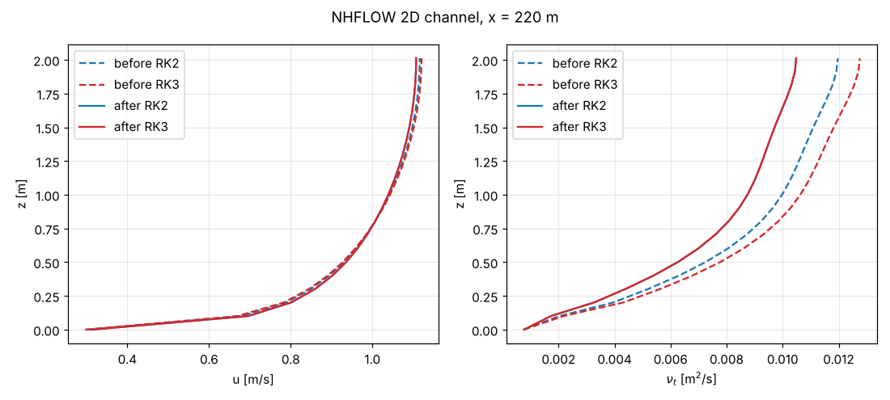

# 02 NHFLOW implicit momentum diffusion and the RK stage weight

## What it shows

In `nhflow_momentum_RK2.cpp` / `nhflow_momentum_RK3.cpp` the implicit diffusion step was called with the
stage weight `alpha` (0.5, 0.25, 2/3), and the same weight was applied again when the stage was combined.
The viscous + turbulent diffusion of the momentum was therefore scaled by alpha², so it depended on the
time scheme (A 510). Turbulence Review patch 0003 calls `diff_u/v/w` with weight 1.0.

Test: 2D open channel, 300 m x 2 m, U = 1 m/s, k-epsilon (A 560 1), 200 x 20 cells, 1200 s, run
until fully developed. In the developed reach (x = 150–280 m) the turbulent shear stress has to carry the
driving stress: (nu + nu_t) du/dz = g S (h − z), S from the slope of the free surface.

- **before:** hans_dev 2118d1d97
- **after:** hans_dev 2118d1d97 + Turbulence Review patches 0003–0007
- Built in a Linux sandbox, g++ 13 `-O2`, without HYPRE, single rank. DIVEMesh hans_dev 95ae3a4.

## Result (z between 0.15 h and 0.6 h, mean over the columns in the reach)

| run | S | (nu+nu_t) du/dz / gS(h−z) |
|---|---|---|
| before, RK2 (A 510 2) | 1.315e-4 | 1.199 ± 0.002 |
| before, RK3 (A 510 3) | 1.276e-4 | 1.369 ± 0.005 |
| after, RK2 | 1.398e-4 | 0.906 ± 0.004 |
| after, RK3 | 1.398e-4 | 0.907 ± 0.004 |

Before the patch the stress ratio, the surface slope and nu_t depend on the time scheme. The ratio is
larger by 1/weight, as expected: 0.91/0.75 = 1.21 (RK2) and 0.91/0.65 = 1.40 (RK3), measured 1.20 and
1.37. After the patch RK2 and RK3 give the same flow. The remaining ratio of 0.91 comes from the
evaluation (vertex-interpolated output, face-averaged nu_t, slope fit over the reach); it is the same
for both schemes.



u and nu_t at x = 220 m. Side observation (open, not changed): nu_t has its maximum at the free
surface; the NHFLOW free-surface damping of k-epsilon is not active in this set-up.

## How to run

From this folder:

```
for c in nhflow_2d_channel_long_ke_rk2 nhflow_2d_channel_long_ke_rk3; do
  ../tools/run_case.sh <REEF3D> <DiveMESH> cases/$c run/$c
done
python3 ../tools/nhf_stress.py run/*
python3 ../tools/nhf_profiles_ab.py profiles.png "RK2=run/nhflow_2d_channel_long_ke_rk2" "RK3=run/nhflow_2d_channel_long_ke_rk3"
```

About 2 minutes per case on one core (9200 time steps).
