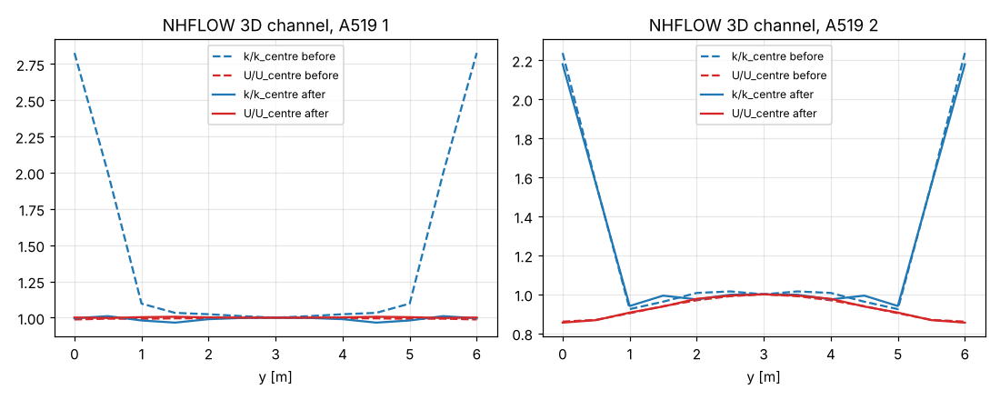
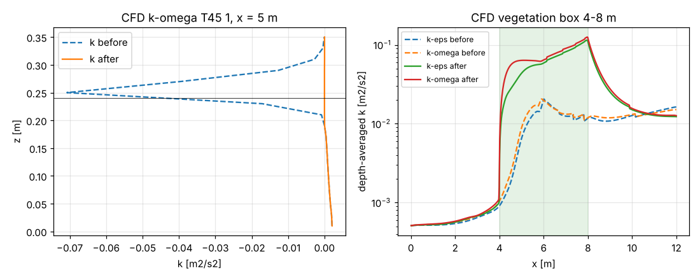

# 03 Turbulence options: NHFLOW walls, buoyancy, vegetation, LES T21 2, SFLOW defaults

Checks for the second set of turbulence patches (Turbulence Review, 2026-10-05):

| patch | change |
|---|---|
| 0008 | NHFLOW: turbulence wall functions only where the momentum has wall friction (bed; side and top walls with A519 2), B11 read the same everywhere, A519 2 friction per wall face on the tangential components |
| 0009 | CFD LES: T21 2 high-pass filter (was empty) |
| 0010 | CFD vegetation: Lopez & Garcia (2001) k, eps, omega sources, drag with \|u\| u_i, w drag sign |
| 0011 | buoyancy term in k (CFD T45, NHFLOW A566): implicit sink, k >= 0 |
| 0012 | CFD k-epsilon: wall/boundary treatment and options as k-omega (direct forcing, VRANS walls, T44, T39, T45, turb_relax) |
| 0013 | SFLOW: A212 1 by default with a turbulence model, A264 3.6, viscous time-step limit, A260 5 off |

- **before:** hans_dev 06b5df103
- **after:** hans_dev 06b5df103 + patches 0008–0013
- Built in a Linux sandbox, g++ 13 `-O2`, without HYPRE, single rank. DIVEMesh hans_dev 95ae3a4.

## Results

### NHFLOW side walls (0008)

3D channel 120 m x 6 m, h = 1.5 m, U = 1 m/s, k-epsilon, side walls (C 12/13 21), 300 s. Profiles across
the width, mean over x = 80–110 m and 0.3–0.7 h (`../tools/nhf_walls.py`).

| case | | k wall / centre | nu_t wall / centre | U wall / centre |
|---|---|---|---|---|
| A519 1 (slip side walls) | before | **2.83** | 0.93 | 0.99 |
| | after | 1.00 | 1.00 | 1.00 |
| A519 2 (side-wall friction) | before | 2.24 | 0.86 | 0.86 |
| | after | 2.18 | 0.87 | 0.86 |

With slip side walls (A519 1) the momentum has no side-wall shear, but the turbulence got wall-function
production there: k was 2.8 times the centre value at the walls. After the patch the profile is flat, as
it has to be for slip walls. With A519 2 the walls have friction in both, and the result is almost
unchanged (the friction now acts only on the tangential components, corner cells feel bed and wall).



### Buoyancy term T45 (0011)

CFD 2D channel with free surface (`cfd_2d_freesurface_*_t45`), T 45 1, 20 s (`../tools/cfd_fields.py`).

| | k min (interface band) | k min (water) | mean k (water) |
|---|---|---|---|
| k-omega before | **−9.7e-2** | −2.1e-2 | 8.8e-5 |
| k-omega after | 0 | 0 | 9.7e-4 |
| k-epsilon before (T45 not available) | 1.5e-4 | 2.1e-4 | 1.06e-3 |
| k-epsilon after | 0 | 0 | 9.0e-4 |

The explicit buoyancy sink at the interface drove k to −0.097 m²/s², 46 times the largest positive k, and
pulled the mean k in the water down to a tenth. With the implicit sink k goes to 0 at the interface and
stays positive; ν_t is damped there as intended.

### Vegetation (0010)

CFD 2D channel (h = 0.24 m, U = 0.36 m/s in the box), vegetation box x = 4–8 m over the full depth,
N = 1000 /m², D = 5 mm, Cd = 1 (a = 5 /m), B 308 0, B 295 1, 30 s.

| | k in the box | k upstream | nu_t in the box |
|---|---|---|---|
| k-epsilon before | 1.05e-2 | 5.8e-4 | 1.5e-3 |
| k-epsilon after | 6.0e-2 | 6.1e-4 | 7.0e-3 |
| k-omega before | 1.17e-2 | 6.1e-4 | 2.0e-3 |
| k-omega after | 7.2e-2 | 6.2e-4 | 8.7e-3 |

Before, the vegetation turbulence sources were off without the porosity reduction (B 308 0) and had wrong
units otherwise; the k in the box came only from the shear the drag creates. Now S_k = ½ Cd a |u|³ acts,
and k-epsilon and k-omega agree (the omega source is derived from the eps source). Note: with the Lopez &
Garcia constants (C_feps = 1.33 < c_2 = 1.92) there is no homogeneous canopy equilibrium, k keeps growing
through the canopy; for this emergent canopy k is about 6 times the stem-scale estimate of Nepf (1999),
k ≈ (Cd a d/2)^(2/3) u² ≈ 0.009 m²/s². Open: calibration for emergent vegetation.



### LES T21 2 (0009)

CFD 2D channel, Smagorinsky (T 10 31), 10 s. Mean ν_sgs in the water:

| | T21 1 | T21 2 |
|---|---|---|
| before | 1.26e-5 | **0** |
| after | 1.26e-5 | 6.5e-6 |

T21 2 gave ν_sgs = 0 (empty filter). The second-order high-pass filter removes more of the resolved large
scales than T21 1, so ν_sgs is about half.

### SFLOW (0013)

Same cases as in 01. Ratio to the local Rastogi–Rodi equilibrium (mean over x = 100–900 m), and the
depth-averaged eddy viscosity:

| case | | nu_t/nu_eq | k/k_eq | nu_t/(u* h) |
|---|---|---|---|---|
| 1D k-epsilon | before (A264 2.7) | 0.996 | 0.996 | 0.137 |
| | after (A264 3.6) | 0.998 | 0.998 | **0.077** |
| 1D k-omega | before | 1.001 | 0.998 | 0.137 |
| | after | 1.001 | 0.998 | 0.077 |
| 2D walls k-epsilon | before / after | 0.966 / 0.974 | 0.972 / 0.979 | |
| 2D walls k-omega | before / after | 0.996 / 0.997 | 0.985 / 0.989 | |

The models reach their equilibrium with either constant; with A264 3.6 the depth-averaged ν_t is the
Rastogi–Rodi value 0.077 u* h. A212 is now 1 in these runs (it was not set): the eddy viscosity enters the
momentum equations (no effect in the uniform flow here).

## How to run

From this folder:

```
../tools/run_all.sh <REEF3D> <DiveMESH> cases run
python3 ../tools/nhf_walls.py  run/nhflow_3d_channel_walls_ke_a1 run/nhflow_3d_channel_walls_ke_a2
python3 ../tools/cfd_fields.py run/cfd_2d_freesurface_kw_t45 run/cfd_2d_freesurface_ke_t45 run/cfd_2d_channel_les_t21_*
python3 ../tools/cfd_fields.py --box 4 8 run/cfd_2d_channel_veg_ke run/cfd_2d_channel_veg_kw
python3 ../tools/sflow_check.py run/sflow_*            # add --ceg 2.7 for runs with the old A264 default
```

The CFD scripts read the regression dump (`run_case.sh` sets `REEF3D_REGRESSION_DIR`). Run time: about
1 hour for all cases on one core (the NHFLOW 3D and vegetation cases take most of it).
