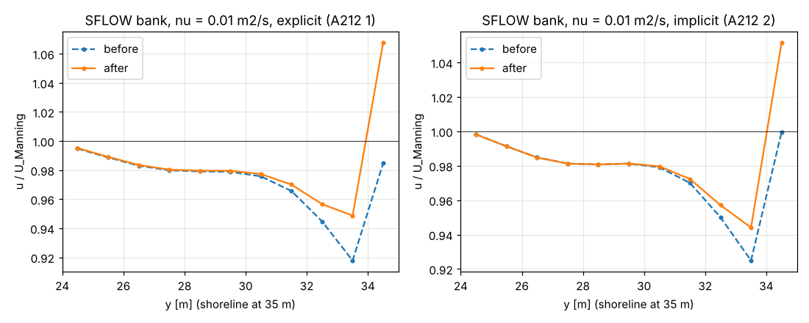

# 04 SFLOW horizontal momentum diffusion at the shoreline (patch 0014)

## What it checks

The SFLOW horizontal momentum diffusion treated dry cells as U = V = 0: in `sflow_idiff` (A212 2) the dry
cell is solved as f = 0 and stayed coupled to its wet neighbour, in `sflow_ediff` (A212 1) the Laplacian used
the dry cell value. The shoreline acted as a no-slip wall, while the turbulence models use a zero-gradient
mirror there. Patch 0014 gives faces to dry cells inside the domain a zero normal gradient (free slip) and
leaves the cross derivative out next to dry cells. Walls and open boundaries are unchanged.

Test: SFLOW channel 400 m x 40 m, flat bed for y < 20 m and a bank (topography T 62) rising 1:10 to the side,
h = 1.5 m, shoreline at y = 35 m, discharge 41 m³/s (U ≈ 1 m/s), Manning roughness (A218 1, ks = 0.01 m),
1500 s. Evaluation over x = 250–350 m: depth-averaged u against the local Manning velocity
U_eq = h^(2/3) S^(1/2)/n (`../tools/sflow_bank.py`, reads the regression dump).

- **before:** hans_dev 06b5df103 + patches 0008–0013 (the turbulence patches now in hans_dev)
- **after:** + patch 0014
- Built in a Linux sandbox, g++ 13 `-O2`, single rank.

## Results

u/U_eq in the last wet cells (y = 33.5 m, h = 0.19 m, and 34.5 m, h = 0.09 m):

| case | | y = 32.5 | y = 33.5 | y = 34.5 |
|---|---|---|---|---|
| ν = 0.01 m²/s, explicit (A212 1) | before | 0.945 | 0.918 | 0.985 |
| | after | 0.957 | 0.949 | 1.068 |
| ν = 0.01 m²/s, implicit (A212 2) | before | 0.950 | 0.925 | 1.000 |
| | after | 0.957 | 0.944 | 1.051 |
| k-ε, explicit / implicit | before → after | < 0.001 change | < 0.001 | 0.002 |

With a constant viscosity the dry cells pulled the shoreline cells down (−8 % in the last cell); with free
slip the shallow cells get momentum from the deeper neighbours instead (u/U_eq > 1 in the last cell), as
lateral diffusion should do. With k-ε the change is negligible because ν_t ∝ u* h vanishes at the shoreline;
the fix matters for constant or breaking viscosity (A246 2, A250 = 1.86 m²/s in the swash zone).



## How to run

From this folder:

```
../tools/run_all.sh <REEF3D> <DiveMESH> cases run
python3 ../tools/sflow_bank.py run/sflow_2d_bank_*
```

About 10 min per case on one core (15 000 time steps).
